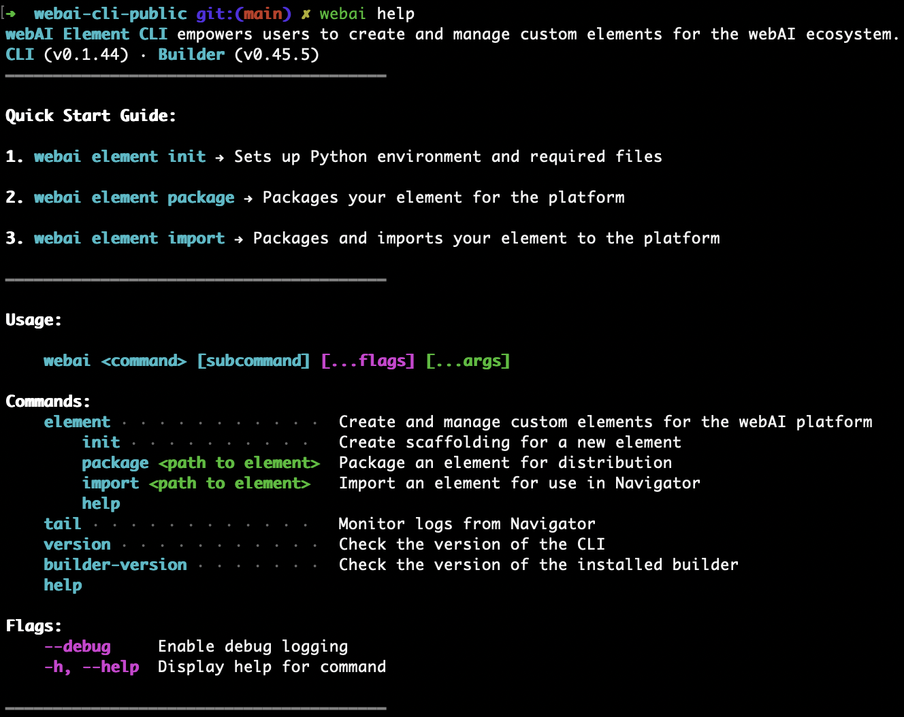

# webAI Element CLI

The webAI Element CLI is the developer entry point into the webAI platform.

This tool is currently in beta - we welcome bug reports and feature requests
through Github issues.

## Installation

First time installation using [homebrew](https://brew.sh/):

```shell
brew tap thewebAI/webai
brew install webai
```

Updating to latest version:

```shell
brew update
brew upgrade webai
```

## Dependencies

- `webAI Navigator` [contact sales](https://www.webai.com/contact-sales)
- `python` [docs](https://www.python.org/downloads/)
- `pip` [docs](https://pip.pypa.io/en/stable/installation/)
- `uv` [docs](https://github.com/astral-sh/uv#installation)

## Usage

Run `webai` to get started



## Developing Elements

Elements are Python programs that can be imported into Navigator and included in
your flows.

```
1. Create an element
webai element init

2. Navigate to the project directory
cd my-element

3. Activate the virtual environment
source venv/bin/activate

4. Add dependencies to requirements.txt
pip install -r requirements.txt

5. Start developing your element in __init__.py

6. Import element into Navigator
webai element import /path/to/my-element
```

## Element Boilerplate

The `webai_element_sdk` library exposes everything you need to create elements.

### Decorators

```python
@element.startup
async def startup(ctx: Context[Inputs, Outputs, None]):
    print(f"Starting...")
```

```python
@element.shutdown
async def shutdown(ctx: Context[Inputs, Outputs, None]):
    print(f"Shutting down...")
```

```python
@element.executor
async def run(ctx: Context[Inputs, Outputs, Settings]):
    print(f"Hello world...")
    # Main element logic goes here
```

### Element Settings

Configurable UI parameters in Navigator to guide element behavior.

```python
"""
Boolean Settings
Implemented as a toggle button
"""

boolean_setting = BoolSetting(
    name="boolean_setting",
    display_name="Boolean Setting",
    default=True
)
```

```python
"""
Number Settings
Integer and Float
"""

# Integer displayed as input fields by default
integer_setting = NumberSetting[int](
    name="integer_setting",
    display_name="Integer Setting",
    default=256,
    min_value=0,
    max_value=1024,
    step=1,
)

# Providing "valid_values" creates a dropdown
dropdown_setting_with_int_values = NumberSetting[int](
    name="dropdown_setting_with_int_values",
    display_name="Int Dropdown Setting",
    valid_values=[0, 1, 2, 3, 4, 5],
    default=1,
)

# Float displayed as sliders by default
float_setting = NumberSetting[float](
    name="float_setting",
    display_name="Float Setting",
    default=0.1,
    min_value=0,
    max_value=1,
    step=0.01,
)

# Providing "valid_values" creates a dropdown
dropdown_setting_with_float_values = NumberSetting[float](
    name="dropdown_setting_with_float_values",
    display_name="Float Dropdown Setting",
    valid_values=[0.0, 0.1, 0.2, 0.3, 0.4, 0.5],
    default=0.1,
)
```

```python
"""
Text Settings
Displayed as input fields by default
"""

text_setting = TextSetting(
    name="text_setting",
    display_name="Text Setting",
    default="Hello, World!",
)

# Providing "valid_values" creates a dropdown
dropdown_setting_with_text = TextSetting(
    name="dropdown_setting_with_text",
    display_name="Text Dropdown Setting",
    valid_values=["Option 1", "Option 2", "Option 3"],
    default="Option 2",
)

# "file_path" hint displays file path selector
file_path_setting = TextSetting(
    name="file_path_setting",
    display_name="File Path Setting",
    default="~/path/to/my/file.txt",
    hints=["file_path"]
)

# "folder_path" hint displays file path selector
folder_path_setting = TextSetting(
    name="folder_path_setting",
    display_name="Folder Path Setting",
    default="~/path/to/my/folder",
    hints=["folder_path"]
)
```
